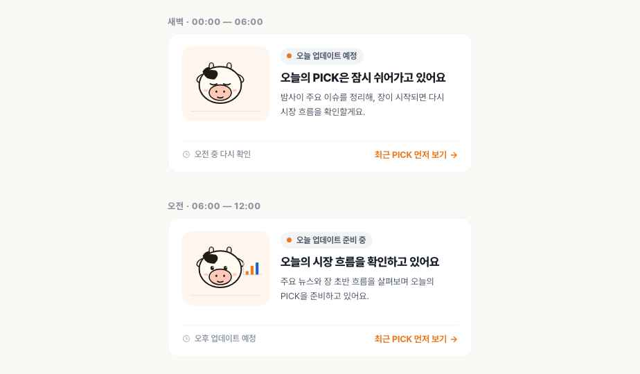
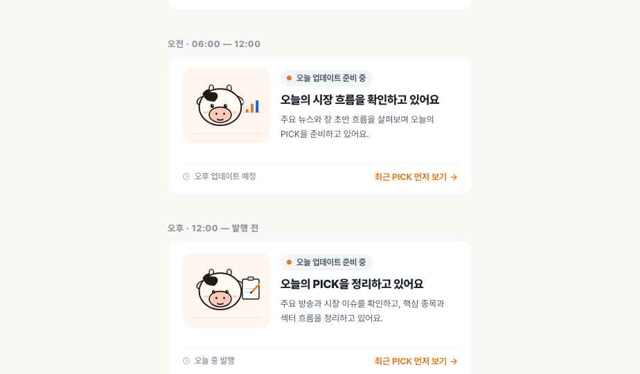

# Handoff: TED PICK 오늘 PICK 준비중 카드 (소 마스코트)

## Overview

TED PICK 메인 피드에서 **오늘 날짜의 PICK 글이 아직 등록되지 않았을 때** `오늘의 PICK` 섹션 최상단에 노출되는 **준비중 상태 카드**입니다.





목적:
- 사이트가 멈춰있거나 운영되지 않는 것처럼 보이는 빈 상태를 방지
- 시간대(새벽 / 오전 / 오후)에 따라 다른 메시지와 마스코트 동작을 보여줘 "오늘도 PICK이 준비되고 있다"는 신뢰감 전달
- 너무 강한 알림이 아닌, 차분하고 신뢰감 있는 안내 카드

피드에 새 글이 1개 이상 등록되면 이 카드는 자동으로 숨기고, 실제 글 카드들이 그 자리에 노출됩니다.

---

## About the Design Files

이 번들에 들어있는 HTML/JSX 파일들은 **디자인 레퍼런스**입니다. 의도된 외형과 동작을 보여주는 프로토타입이며, 그대로 프로덕션에 복붙해서 쓰는 코드가 아닙니다.

작업은 **이 디자인을 TED PICK 코드베이스의 기존 환경(Astro + Vanilla JS + `src/styles/global.css`)에서 재구현**하는 것입니다. 코드베이스에 이미 같은 디자인 토큰(`assets/global.css` ≒ `src/styles/global.css`)이 들어있다면 그대로 활용하면 됩니다.

---

## Fidelity

**High-fidelity (hifi)** — 색상, 타이포, 간격, 인터랙션, 애니메이션 타이밍이 모두 최종값에 맞춰져 있습니다. 픽셀 단위로 그대로 재현해 주세요.

단, 소 캐릭터 SVG는 디자이너가 코드로 직접 그린 것입니다. 디자인 톤은 유지하되, 코드베이스에 일러스트 컴포넌트 패턴이 있다면 거기에 맞게 옮기거나 별도 SVG 자산으로 export해도 됩니다.

---

## 노출 / 숨김 로직

```ts
// 의사 코드
const todayKey = formatDateKST(new Date()); // 'YYYY-MM-DD'
const hasTodayPost = posts.some(p => p.dateKey === todayKey);

if (!hasTodayPost) {
  // 오늘 PICK divider 아래에 <PrepCard band={currentBand()} /> 노출
} else {
  // 카드 숨기고, 실제 오늘 글 카드들만 노출
}
```

시간대 (`band`) 판정 (KST 기준):

```ts
function currentBand(): 'dawn' | 'premarket' | 'earlymarket' | 'midday' | 'afternoon' {
  const h = new Date().getHours();
  const m = new Date().getMinutes();
  const t = h + m / 60;
  if (t < 6)    return 'dawn';        // 00:00–06:00
  if (t < 9)    return 'premarket';   // 06:00–09:00
  if (t < 11.5) return 'earlymarket'; // 09:00–11:30
  if (t < 13.5) return 'midday';      // 11:30–13:30
  return 'afternoon';                 // 13:30–발행 전
}
```

> 시간대가 자정 / 06시 / 12시를 넘어갈 때 페이지에 머무르고 있는 사용자에게도 카드가 자연스럽게 바뀌면 좋지만, 우선순위는 낮습니다. 5–10분에 한 번 `setInterval`로 다시 계산하거나, 다음 페이지 진입 시점에 반영해도 충분합니다.

---

## 시간대별 카피 (확정)

| band | 시간 | 마스코트 | 상태 칩 | 타이틀 | 설명 | ETA |
|---|---|---|---|---|---|---|
| `dawn` | 00:00–06:00 | sleeping | `● 오늘 업데이트 예정` | 오늘의 PICK은 잠시 쉬어가고 있어요 | 밤사이 주요 이슈를 정리해, 장이 시작되면 다시 시장 흐름을 확인할게요. | 오전 중 다시 확인 |
| `premarket` | 06:00–09:00 | watching | `● 개장 전 체크 중` | 개장 전 이슈를 살펴보고 있어요 | 밤사이 글로벌 시장과 주요 뉴스를 확인하며 오늘의 PICK을 준비하고 있어요. | 오전 업데이트 예정 |
| `earlymarket` | 09:00–11:30 | watching | `● 시장 확인 중` | 장 초반 흐름을 확인하고 있어요 | 시장 방향과 주요 섹터 움직임을 살펴보며 오늘의 PICK에 담을 내용을 정리하고 있어요. | 오후 업데이트 예정 |
| `midday` | 11:30–13:30 | organizing | `● 오전장 정리 중` | 오전장 흐름을 정리하고 있어요 | 오전장 흐름과 주요 종목 움직임을 확인하며 오늘의 핵심 포인트를 추려보고 있어요. | 오후 업데이트 예정 |
| `afternoon` | 13:30–발행 전 | organizing | `● 곧 업데이트 예정` | 오늘의 PICK을 정리하고 있어요 | 주요 방송과 시장 이슈를 확인하고, 핵심 종목과 섹터 흐름을 정리하고 있어요. | 오늘 중 발행 |

**CTA**: `최근 PICK 먼저 보기 →` (모든 시간대 공통)
- 클릭 시 동작: 어제 또는 가장 최근에 발행된 PICK 글의 상세 페이지로 이동 (`/post/[가장 최근 글 slug]`)
- 대안: 동작 없이 단순히 페이지를 아래로 스크롤시켜 어제 글 섹션이 보이게 해도 무방

---

## Layout 상세

### 카드 컨테이너 (`.prep`)

```
┌─────────────────────────────────────────────────┐
│  ┌─────────┐  ● 오늘 업데이트 준비 중           │
│  │         │                                     │
│  │   🐄    │  오늘의 PICK을 정리하고 있어요     │  ← title
│  │  (Cow)  │                                     │
│  │         │  주요 방송과 시장 이슈를 확인하고  │  ← desc
│  └─────────┘  핵심 종목과 섹터 흐름을 정리해요  │
│                                                  │
│  ─────────────────────────────────────────────  │
│  🕐 오늘 중 발행            최근 PICK 먼저 보기 →│
└─────────────────────────────────────────────────┘
```

- **외곽**: `background: var(--card)` (`#ffffff`) / `border: 1px solid var(--border)` (`#f2f4f6`) / `border-radius: 16px`
- **padding**: `18px 20px`
- **레이아웃**: `display: grid; grid-template-columns: auto 1fr; gap: 16px; align-items: center;`
- **margin-bottom**: `10px` (다음 카드와의 간격 — 기존 `.post-card`와 동일)
- **width**: 부모 컨테이너 가득 (모바일 기준 `.feed-wrap` max-width 680px 안에서 100%)

### 마스코트 슬롯 (`.prep-cow-slot`)

- **size**: `126 × 108`
- **background**: `#fff7ef` (브랜드 오렌지의 매우 옅은 톤)
- **border-radius**: `14px`
- **position**: relative, `overflow: hidden`
- **장식**: 내부 하단에 1px ground line — `::before { left:12; right:12; bottom:14; height:1; background: rgba(31,26,20,0.08); }`
- **내부**: Cow SVG (size 96px), 가운데 정렬

### 텍스트 영역 (`.prep-text`)

`min-width: 0`만 지정 (긴 텍스트 줄바꿈 위해).

### 상태 칩 (`.prep-status`)

- inline-flex, gap 7px, padding `5px 10px 5px 9px`
- background `var(--border)` (`#f2f4f6`), border-radius `999px`
- font 12px / 700 / letter-spacing -0.01em / color `var(--text-2)` (`#4e5968`)
- margin-bottom 8px
- 안에 펄스 도트(`.prep-dot`) + 텍스트

### 펄스 도트 (`.prep-dot`)

- 7×7 원, `background: var(--blue)` (`#ed781f`)
- 박스섀도우 펄스 애니메이션 (1.8s ease-out infinite)

```css
@keyframes prep-pulse {
  0%   { box-shadow: 0 0 0 0 rgba(237,120,31, 0.45); }
  70%  { box-shadow: 0 0 0 7px rgba(237,120,31, 0); }
  100% { box-shadow: 0 0 0 0 rgba(237,120,31, 0); }
}
```

### 타이틀 (`.prep-title`)

- `h3`, font 17px / 800 / letter-spacing -0.02em / line-height 1.4
- color `var(--text-1)` (`#191f28`)
- margin `0 0 6px`

### 설명 (`.prep-desc`)

- `p`, font 13px / 400 / line-height 1.6
- color `var(--text-2)` (`#4e5968`)
- margin 0

### Footer (`.prep-foot`)

- grid-column `1 / -1` (양쪽 영역 가로지름)
- margin-top 12px / padding-top 12px / border-top `1px solid var(--border)`
- display flex, justify-content space-between, align-items center, gap 12px

#### Footer 좌측 — ETA

- inline-flex, gap 6px
- 12×12 시계 아이콘 (opacity 0.7) + 텍스트 12px / 600 / `var(--text-3)` (`#8b95a1`)
- 시계 아이콘: SVG 24×24 viewBox, `<circle cx=12 cy=12 r=9>` + `<path d="M12 7v5l3 2">`, strokeWidth 2.2

#### Footer 우측 — CTA

- button, font 13px / 700 / letter-spacing -0.01em
- color `var(--blue)` (`#ed781f`), hover `var(--blue-dark)` (`#c45e0a`)
- 화살표 `→` 표시 (별도 span, font-weight 800)
- background none / border none / padding 0

---

## 소 마스코트 (Cow)

소스: `cow.jsx` — 단일 React 함수 컴포넌트. 다른 코드베이스로 옮길 때는 SVG 마크업을 그대로 가져오고, 분기 조건(state prop)에 따라 다른 부분만 렌더하도록 하면 됩니다.

### Props

```ts
type CowProps = {
  state: 'sleeping' | 'watching' | 'organizing';
  size?: number; // px, 기본 108. 카드 안에서는 96 사용
};
```

### SVG 기본

- `viewBox="0 0 140 120"`
- `<svg>`에 `overflow: visible` 필요 (Z·차트·클립보드가 머리 옆으로 빠져나오기 때문)
- 컨테이너 div 비율: `width = size * 140/120`, `height = size`

### 공통 본체 (모든 state)

- 둥근 크림색 머리 ellipse (cx 60, cy 62, rx 38, ry 33), fill `#fffaf2`, stroke `#1f1a14` width 2.5
- 머리 위에 검은 카우프린트 패치 path (`#1f1a14`)
- 양 옆 귀 (rotate ±28°), 바깥쪽 크림 + 안쪽 핑크 `#ffd4cc`
- 머리 위 작은 뿔 두 개 (ellipse, fill `#f5e8d0`, stroke 검정)
- 핑크 muzzle ellipse (cx 60, cy 76, rx 20, ry 14), fill `#ffc9b9`, stroke 검정
- 양 옆 볼터치 ellipse, fill `#ffb0a0`, opacity 0.55
- 작은 미소 path (Q 곡선)
- **본체 전체에 `cow-breathe` 호흡 애니메이션** (scale 1 → 1.02 → 1, 3.4s ease-in-out infinite)

### state별 차이

#### `sleeping` (새벽)
- **눈**: 감긴 `⌒ ⌒` (path `Q` 곡선 두 개, strokeWidth 2.4)
- **장식**: 머리 옆에 `z · z · z` 3개의 텍스트, 시간차로 페이드인하며 위로 떠오름
  - `.z1` 0s delay, `.z2` 0.9s, `.z3` 1.8s — 각 2.8s ease-out infinite
  - opacity 0 → 1 → 0, translate (0,6) → (4,-10)
- **본체**: 호흡 대신 `cow-sleep-bob` (translateY 0 → 3px, scale 1 → 1.025, 3.6s)

#### `watching` (오전)
- **눈**: 동그란 검정 ellipse 두 개 + 흰색 반사점 1px
- **눈동자 좌우 스캔**: `.eyes-scan` 그룹에 `translateX -2.5 ↔ 2.5px` (2.4s ease-in-out infinite)
- **귀 까딱**: `.ear-l`은 4.8s 주기로 한 번 `-10deg` 까딱, `.ear-r`은 2.4s 늦게 같은 패턴
- **장식 (차트)**: 머리 오른쪽에 작은 막대 그래프 3개 (`#ed781f`, `#ed781f`, `#1763d6`)
  - 각 막대 `scaleY 0.65 ↔ 1` 펄스, 1.8s 주기, delay 0 / 0.3 / 0.6s 시차

#### `organizing` (오후)
- **눈**: 약간 작은 검정 ellipse + 흰 반사점 (집중하는 느낌)
- **머리 끄덕임**: 본체에 `cow-nod` (rotate -3° ↔ 2°, 3.2s ease-in-out infinite, origin 60,90)
- **장식 (클립보드)**: 머리 오른쪽 흰 클립보드 30×36 + 위쪽 클립 + 안에 3줄
  - 3줄은 `stroke-dasharray: 22`로 시작해 `stroke-dashoffset: 22 → 0` 그려지는 효과 (4.5s 주기, 각 1.5s 간격)
- **연필 흔들기**: 주황색 stroke 연필이 `translate + rotate -10deg` 왕복 (1.4s ease-in-out infinite)

### 색상 팔레트 (마스코트)

| 용도 | hex |
|---|---|
| 본체 크림 | `#fffaf2` |
| 카우 패치 | `#1f1a14` |
| 뿔 | `#f5e8d0` |
| 귀 안쪽 / muzzle | `#ffd4cc` / `#ffc9b9` |
| 볼터치 | `#ffb0a0` (opacity 0.55) |
| 슬롯 배경 | `#fff7ef` |
| z (잠) | `#94a0ad` |
| 차트 막대 (상승 / 하락) | `#ed781f` / `#1763d6` |
| 클립보드 본체 | `#ffffff` |
| 클립보드 줄 | `#cbd2da` |
| 연필 | `#ed781f` |

---

## Design Tokens (모두 기존 `global.css`에 존재)

```css
--blue:        #ed781f;  /* 브랜드 오렌지 — 펄스 도트, CTA, 연필, 차트 상승 막대 */
--blue-dark:   #c45e0a;  /* CTA hover */
--bg:          #FAF9F6;  /* 페이지 배경 */
--card:        #ffffff;  /* 카드 배경 */
--border:      #f2f4f6;  /* 카드 outline, 상태칩 배경, foot divider */
--text-1:      #191f28;  /* 타이틀 */
--text-2:      #4e5968;  /* 본문, 상태칩 텍스트 */
--text-3:      #8b95a1;  /* ETA, 메타 */
--down:        #1763d6;  /* 차트 하락 막대 (기존 한국식 파란색) */
--font:        Pretendard Variable
```

신규로 추가되는 값은 마스코트 SVG 내부 색상(#fffaf2, #ffc9b9, #ffd4cc, #f5e8d0, #fff7ef, #ffb0a0, #cbd2da, #94a0ad, #1f1a14)뿐입니다. 이 값들은 마스코트 컴포넌트 안에 hard-coded로 들어가도 무방하지만, 공유 자산화하고 싶다면 `--cow-*` 토큰으로 분리하는 것도 좋습니다.

---

## 반응형 / Responsive

기본 디자인이 모바일 폭(440 이하)에 최적화되어 있고, 데스크탑(680px feed-wrap)에서도 그대로 잘 보입니다.

- 카드 자체는 모든 폭에서 동일한 grid 레이아웃을 유지합니다 — 마스코트가 항상 왼쪽, 텍스트가 오른쪽.
- **추가 분기 불필요** — 단, 폭이 360px 미만으로 떨어지면 마스코트 슬롯을 100px×88px로 살짝 줄이는 옵션은 고려해볼 만합니다 (현재 디자인 기준 360px에서도 깨지지 않음).

---

## Accessibility

- 펄스 도트는 `aria-hidden="true"`로 가려도 좋습니다. 동일한 의미가 상태 칩 텍스트("오늘 업데이트 준비 중")에 이미 전달되고 있습니다.
- 카드 전체에 `role="status"`와 `aria-live="polite"`를 부여해 스크린리더가 상태를 안내하게 하는 걸 권장합니다.
- 마스코트 SVG는 장식 — `aria-hidden="true"`로 막아주세요 (`cow.jsx`에 이미 들어있음).
- CTA 버튼은 키보드 포커스 가능해야 하고, focus ring은 코드베이스의 기본 focus 스타일을 따릅니다.
- **`prefers-reduced-motion: reduce`**: 마스코트의 모든 애니메이션과 펄스 도트가 멈추도록 미디어쿼리가 들어있습니다. 정지 상태에서도 디자인이 자연스럽게 보이도록 SVG가 그려져 있습니다.

---

## State Management

이 컴포넌트는 **읽기 전용**입니다. 별도 상태 관리가 없고, 필요한 입력은 두 가지뿐입니다:

1. `band: 'dawn' | 'morning' | 'afternoon'` — 부모에서 시간 기반 계산값을 prop으로 내려주는 것을 권장
2. (선택) 최근 발행글 slug — CTA 클릭 시 이동할 목적지

부모는 다음만 계산해 주면 됩니다:

```ts
const showPrepCard = !posts.some(p => p.dateKey === todayKey);
const band = currentBand();
```

---

## Files (이 번들에 포함된 파일)

| 파일 | 용도 |
|---|---|
| `README.md` | 본 문서 |
| `prep-card-standalone.html` | **단독 레퍼런스** — 카드 3개 (새벽/오전/오후)만 세로로 쌓아 보여줌. 가장 옮기기 쉬운 형태 |
| `prep-card.html` | 4가지 시각 변형(A/B/C/D/E)을 비교한 디자인 캔버스 — 의사결정 맥락 참고용 |
| `prep-card.jsx` | 위 캔버스의 React 컴포넌트 소스 |
| `cow.jsx` | 소 마스코트 SVG 컴포넌트 (단일 파일, 약 130줄) |
| `assets/global.css` | TED PICK 디자인 토큰 — 코드베이스의 `src/styles/global.css`와 동일. 참고용 |

**구현 시 우선 참고할 파일**: `prep-card-standalone.html` + `cow.jsx`. 이 두 개만 보면 변형 E를 그대로 옮길 수 있습니다.

---

## TED PICK 코드베이스에서의 통합 위치

`src/pages/index.astro` (메인 피드) 안에서 `오늘의 PICK` date-divider 직후에 다음과 같이 끼우면 됩니다:

```astro
---
import PrepCard from '../components/PrepCard.astro';

const todayKey = new Date().toISOString().slice(0, 10);
const todayPosts = posts.filter(p => p.data.dateKey === todayKey);
const showPrep = todayPosts.length === 0;
---

<div class="date-divider date-divider--today">
  <span class="date-divider-label">오늘의 PICK</span>
</div>

{showPrep && <PrepCard />}
{todayPosts.map(p => <PostCard post={p} />)}
```

`PrepCard.astro` 안에서 클라이언트 사이드로 band를 계산해 적용:

```astro
<div class="prep" data-prep-card>...</div>
<script>
  const root = document.querySelector('[data-prep-card]');
  function bandFromHour(h, m) {
    const t = h + m / 60;
    if (t < 6)    return 'dawn';
    if (t < 9)    return 'premarket';
    if (t < 11.5) return 'earlymarket';
    if (t < 13.5) return 'midday';
    return 'afternoon';
  }
  function apply() {
    const band = bandFromHour(new Date().getHours());
    root.dataset.band = band;
    // band별 텍스트/마스코트 state 교체
  }
  apply();
  setInterval(apply, 5 * 60 * 1000); // 5분마다 재계산
</script>
```

대안: SSR 시점에 `band`를 정해 카피 3종 중 하나만 미리 렌더하고, 정각 시간대 경계는 다음 페이지 진입 때 반영. 더 단순하고 추천.

---

## 우선순위 체크리스트

1. ✅ 사이트가 살아있다는 느낌 (펄스 도트 + 마스코트 호흡 애니메이션)
2. ✅ 오늘 콘텐츠가 준비 중이라는 신뢰감 (시간대별 다른 메시지)
3. ✅ 모바일에서 부담 없이 읽히는 간결함 (440px 너비 기준 최적화, 카피 2줄 이내)
4. ✅ 기존 TED PICK 피드 디자인과의 자연스러운 연결 (`.post-card`와 동일한 16px radius, border, padding 톤)


